# Semantic-release Lifecycles

Semantic-release runs lifecycle hooks in order. For a new release, the important
boundary is that semantic-release creates and pushes the Git tag after
`prepare` and before `publish`.

```mermaid
flowchart LR
    accTitle: Semantic Release Boundary
    accDescr: The diagram shows where work can still abort a release before the Git tag is created and where work happens after the Git tag exists.

    verify["verifyConditions"]
    analyze["analyzeCommits"]
    verify_release["verifyRelease"]
    notes["generateNotes"]
    prepare["prepare"]
    git_tag["Git tag and push"]
    publish["publish"]
    add_channel["addChannel"]
    success["success"]
    fail["fail"]

    verify --> analyze --> verify_release --> notes --> prepare --> git_tag --> publish --> add_channel --> success
    verify -.->|handled error| fail
    verify_release -.->|handled error| fail
    prepare -.->|handled error| fail
    publish -.->|handled error| fail

    classDef pre_tag fill:#dcfce7,stroke:#16a34a,color:#14532d
    classDef tag_boundary fill:#fef9c3,stroke:#ca8a04,color:#713f12
    classDef post_tag fill:#fee2e2,stroke:#dc2626,color:#7f1d1d
    classDef terminal fill:#dbeafe,stroke:#2563eb,color:#1e3a5f

    class verify,analyze,verify_release,notes,prepare pre_tag
    class git_tag tag_boundary
    class publish,add_channel post_tag
    class success,fail terminal
```

## Hook Purposes

`verifyConditions` checks static prerequisites: config, env vars, binaries, and
credentials that can be validated without knowing the next version.

`analyzeCommits` decides whether a release is needed and which release type it
is. Implement this only when default commit analysis is not enough.

`verifyRelease` checks the computed release: version, channel, dist-tag, and
other values that depend on `nextRelease`.

`generateNotes` creates release notes. Keep it pure: read commit/release data
and return text.

`prepare` performs work that must succeed before the Git tag exists. Use it for
version files, generated release assets, and external mutations that must abort
the release if they fail.

`publish` publishes artifacts after the Git tag exists. Do not put work here if
a failure must prevent the Git tag from being pushed.

`addChannel` attaches an existing release to another channel. It is for channel
promotion, not new release creation.

`success` notifies or records a completed release.

`fail` notifies or cleans up after a handled release failure. Cleanup must be
best-effort because the original failure is already the primary result.

## See also

- [Reliable semantic-release components](./reliable-semantic-release-components.md)
- [Semantic-release plugin development](https://semantic-release.gitbook.io/semantic-release/developer-guide/plugin)
